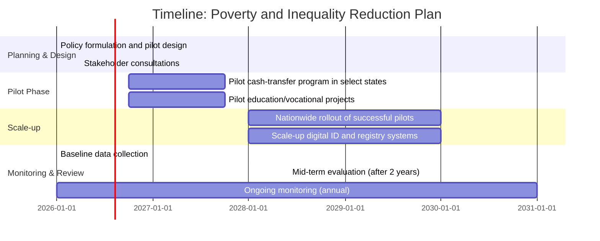

## Executive Summary  
Poverty and inequality remain critical challenges globally and in India.  Despite impressive gains – India’s poverty rate has fallen from roughly half of the population in the 1970s to about 5% under the World Bank’s $3/day poverty line【24†L433-L436】 – millions still live near or below subsistence levels, and disparities persist between regions and social groups.  This blog uses a problem-solving framework to analyze these issues.  We first define poverty and inequality, then examine root causes (such as unequal asset distribution, labor market barriers, and systemic exclusion).  We review successful international interventions (e.g. Brazil’s *Bolsa Família* and Ghana’s LEAP cash-transfer programs) and draw lessons for India.  Proposed solutions include targeted cash transfers, improved social safety nets, skill and education investments, and progressive taxation.  Implementation steps outline how to pilot, scale, and monitor such programs.  Recommendations cover short-, medium-, and long-term policy measures, as well as grassroots actions (e.g. community self-help groups).  We estimate that comprehensive programs may cost on the order of several percent of GDP (or ₹crores annually) and suggest funding from national budgets, multilateral aid, and public–private partnerships.  Key stakeholders include government ministries (finance, social welfare, labor), local governments, NGOs, and the private sector.  We propose measurable indicators (poverty headcount, Gini coefficient, enrollment rates, etc.) with phased timelines (1–3 year pilot, 3–5 year scale-up, 5–10 year full impact).  A comparison table summarizes different interventions (cash transfers, wage guarantees, education subsidies) along with rough cost and outcome expectations.  A Gantt chart outlines a sample timeline for phased implementation. All recommendations are evidence-based and draw on recent data and peer-reviewed studies【11†L168-L172】【27†L98-L102】.  

## Problem Definition  
**Poverty** is typically defined by income or consumption below a basic needs threshold.  According to the World Bank, extreme poverty in India (living under ~$3.00/day PPP) fell from ~50% in the 1970s to roughly 5.3% by 2022【24†L433-L436】.  Using a lower $2.15/day threshold (new extreme poverty line), India’s rate in 2022–23 was only ~2.3%【27†L98-L102】.  In absolute numbers this still means tens of millions live in extreme deprivation, and many more are “vulnerable” (just above the line).  **Economic inequality** refers to the uneven distribution of income or wealth.  India’s Gini coefficient – a common measure of inequality (0=perfect equality, 100=maximal inequality) – was reported at ~25.5 in 2022–23【27†L98-L102】, unusually low by global standards (lower than China’s ~35.7 and much lower than the U.S.~41.8)【27†L98-L102】.  India’s low Gini reflects historical redistribution through land reforms, pensions, and targeted welfare, but large gaps remain in access to education, health, and formal jobs.  

Despite progress, the *nature* of poverty and inequality has evolved.  Many of India’s poor live in rural areas and rely on agriculture; urban poverty persists in slums.  Caste, gender and regional disparities compound economic inequality.  Social exclusion keeps Dalits, Adivasis, and Muslims in disproportionately poor positions.  Moreover, inequalities in land ownership, asset access, and quality education entrenches income gaps across generations.  The COVID-19 pandemic and recent inflation surges have also put upward pressure on poverty.  Key metrics include the poverty headcount ratio (national and rural/urban), Gini index, and the **Multidimensional Poverty Index** (considering health, education, living standards).  Recent data (World Bank 2025) show India has lifted ~171 million people out of extreme poverty between 2011 and 2023【27†L98-L102】, but challenges remain: for example, only ~43% of 5th graders can read a basic text【58†L106-L113】 (education ties back into poverty dynamics).

## Causes of Poverty and Inequality  
The causes of poverty and inequality are multi-faceted:

- **Structural economic factors:** Rapid economic growth in India has been uneven.  High-skilled sectors (IT, finance) grew faster than labor-intensive manufacturing, limiting job creation for the poor.  Agriculture’s share of GDP fell without sufficient non-farm absorption, trapping many in low-productivity farming.  Market liberalization favored the wealthy and urban middle class more than the rural poor.  
- **Skill and educational gaps:** Limited access to quality education means many poor children leave school early or illiterate.  As of 2024, only ~43% of Class 5 students in government schools could read at their grade level【58†L106-L113】.  This perpetuates underemployment or very low-wage labor.  
- **Social exclusion:** Discrimination (caste, tribe, gender) limits opportunities.  Landlessness among marginalized castes/tribes reduces rural incomes.  Women’s labor-force participation is low (only ~24% in 2024), reflecting inequality in economic empowerment.  
- **Weak social safety nets:** Gaps in social protection (pension, unemployment insurance) mean shocks (illness, drought, job loss) can push families back into poverty.  Many informal workers lack formal insurance or savings.  
- **Market failures:** Lack of access to affordable credit, markets, and inputs (seeds, technology) hinders smallholder and micro-entrepreneurs from scaling up.  
- **Fiscal policy:** Regressive tax structures and underfunded public services can exacerbate inequality. 

These factors interact: e.g. poverty limits access to education/health, which in turn limits future earnings (a poverty trap).  Large families, poor health, and indebtedness reinforce income inequality.  Understanding these root causes is essential to designing effective interventions.

## International Case Studies

### Brazil – Bolsa Família (Conditional Cash Transfer)  
**Context & Design:**  Introduced in 2003, *Programa Bolsa Família* consolidated several existing benefits into one large cash-transfer scheme.  Low-income families receive monthly transfers (~R$15–R$95 depending on family composition) on the **condition** that children attend school and family members receive basic healthcare (e.g. vaccinations)【9†L428-L436】.  The program targeted the extreme poor (about 12 million families at launch) using a single unified registry.  

**Implementation & Outcomes:**  Bolsa Família is widely cited as a successful model.  It achieved precise targeting and substantial poverty reduction: independent studies estimate that without Bolsa Família, Brazil’s extreme poverty would have been one-third higher during 2003–2010【11†L168-L172】.  The program contributed ~15% of the reduction in Brazil’s Gini coefficient in the 2000s【11†L168-L172】.  Evaluations documented positive effects on human capital: school attendance and grade progression rose significantly (especially for girls)【11†L174-L180】, and child mortality declined as families invested in health【11†L174-L180】.  Concerns that cash transfers reduce adult labor supply were largely unfounded【11†L174-L180】.  Key to success was strong political commitment, good governance (an integrated beneficiary registry, decentralization of implementation, and minimal interference), and gradual scaling-up (by 2006, coverage reached ~45 million people)【9†L431-L440】【11†L168-L172】.

**Adaptation to India:**  India already has analogous programs (e.g. Janani Suraksha Yojana, conditional on hospital births; mid-day meals for schoolchildren).  Lessons for India include: robust beneficiary registries to avoid leakage; conditionality to link immediate aid to long-term human capital gains; and decentralizing implementation to local governments.  A pilot might focus on poorest rural blocks or urban slums, building on existing databases (Aadhaar, Public Distribution System) to target beneficiaries.  Transfer amounts should be calibrated to local poverty lines (e.g. cash equal to a substantial fraction of a family’s daily needs).  India could integrate *Bolsa*-style transfers with its Direct Benefit Transfer (DBT) infrastructure to minimize corruption.  Since government finance is more constrained than Brazil’s at the time, a phased rollout is prudent: start in poorest states, evaluate impact, then expand.

### Ghana – LEAP (Livelihood Empowerment Against Poverty)  
**Context & Design:**  Ghana’s LEAP program (launched 2008) provides unconditional cash transfers to extremely poor households (orphans, elderly, people with disabilities)【21†L64-L73】.  Beneficiaries receive bi-monthly grants and health-insurance enrollment waivers.  As of 2024, LEAP reached ~360,000 households nationwide【21†L69-L73】.  An extension (LEAP 1000) targets pregnant/lactating women to improve birth outcomes.

**Implementation & Outcomes:**  Government and UNICEF evaluations report that LEAP reduced food insecurity, improved school attendance and healthcare utilization, and stimulated local economies【21†L64-L73】.  For example, LEAP 1000 in Northern Ghana increased antenatal visits and facility births.  Because of limited administrative data in Ghana, precise statistics on poverty impact are scarce in open sources, but qualitative studies find that cash transfers help families smooth consumption and invest in farming or small trade.  Crucially, the unconditional model allows flexibility, while the health-insurance component encourages preventive care.  

**Adaptation to India:**  An unconditional cash-transfer for vulnerable groups (elderly, disabled, pregnant women) could complement India’s existing pensions and maternity schemes.  India has seen UBI pilot studies (e.g. in Madhya Pradesh 2020), but no national rollout.  A LEAP-like program in India would require a clear registry of eligible households (one could build on the Socio-Economic Caste Census data).  Benefits could be modest (e.g. ₹1,000–2,000 per month per household) but enough to buy basic food and medicines.  Unlike *Bolsa Família*, such transfers would not require compliance with conditions, simplifying monitoring.  Community outreach (through ASHA workers, panchayats) could ensure awareness.  Budgets could come from central/state welfare funds and international development partners (e.g. UN or World Bank).

### (Optional) Mexico – Oportunidades/Prospera (CCT)  
Mexico’s *Oportunidades* (later *Prospera*) is another well-known CCT.  Evaluations show it significantly improved nutrition, education, and health among poor rural families.  For instance, preventive healthcare utilization rose by over 50%, childhood illnesses fell, anemia decreased, and child growth improved【19†L344-L352】.  Such outcomes parallel Brazil’s experience, reinforcing the evidence that CCTs can break the inter-generational poverty cycle【19†L344-L352】.  Lessons include the importance of giving transfers to women (as done in Mexico) and of large enough cash amounts (Mexico’s transfers were ~1/3 of household income【19†L371-L381】).  India’s experience with conditional programs (e.g. giving school uniforms, bicycles, etc.) could be re-evaluated to consider direct cash alternatives with conditions for schooling/health.  

## Proposed Solutions  
Based on the above analysis and case studies, we propose a multi-pronged poverty-and-inequality reduction strategy:

- **Expand Targeted Cash Transfers:**  Scale up well-designed cash-assistance programs for poor households (rural and urban).  Ideally, combine conditional (for families with children) and unconditional transfers.  Use transparent digital DBT to send funds directly (e.g. to women’s Jan Dhan accounts).  Ensure adequate benefit levels (e.g. ~₹2,000–3,000/month per family) to cover minimum needs.  Coordinate with existing schemes (e.g. PDS, MGNREGA) to avoid duplication【9†L431-L440】【11†L168-L172】.  
- **Improve Education & Health Investments:**  Augment spending on universal education and health, especially for marginalized groups.  Investing in human capital combats poverty long-term.  For example, subsidized tuition, mid-day meals, school sanitation and teacher training will improve literacy and skills, reducing income inequality later.  
- **Livelihood & Job Programs:**  Strengthen employment schemes for rural and urban poor.  Expand MNREGA (rural job guarantee) and consider urban employment initiatives.  Enhance skill-development programs tied to local economic opportunities (e.g. agro-processing clusters, digital economy training).  
- **Progressive Taxation & Social Welfare:**  Introduce or reinforce progressive taxes on high incomes, capital gains, and land, and use revenues to fund anti-poverty programs.  Curb regressive subsidies (e.g. fuel, fertilizer) to free fiscal space.  Rationalize tax exemptions that benefit only the wealthy.  
- **Financial Inclusion & Credit Access:**  Build on PMJDY to ensure poorest have bank accounts and credit.  Provide micro-credit at subsidized rates to encourage entrepreneurship.  Promote cooperatives and self-help groups (e.g. women’s SHGs) for livelihood development.  
- **Land and Asset Reforms:**  Enforce land ceiling laws where applicable, and support landless with land lease or homestead programs.  Provide subsidized housing and title deeds for slum dwellers.  
- **Social Equity Policies:**  Strengthen anti-discrimination laws and targeted programs (scholarships, reservation for SC/ST/OBC) to level the playing field.  Enforce gender parity schemes, such as conditional cash for girls’ education.  

In summary, the solution combines **redistribution** (cash transfers, tax reforms) with **investment** (education, health) and **empowerment** (jobs, credit).  These measures should be tailored to India’s context (dense rural poverty pockets, caste dynamics).  Table 1 below compares key interventions, costs, and expected outcomes:

| Intervention                 | Estimated Cost (annual) | Expected Impact (example)              | Notes                                          |
|------------------------------|-------------------------|---------------------------------------|------------------------------------------------|
| CCT/UBI transfers            | ₹50–100K crore (unspecified) | Income ↑ for ~10–50m families (poverty drop by several %) | Fund via central budgets + concessional loans; coordinate with Aadhaar/DBT【11†L168-L172】【9†L431-L440】. |
| Education quality investment | ₹20–50K crore (unspecified) | Literacy ↑, future income ↑ (reduced inequality) | Train 1m teachers, build/renovate schools; donors/CSR support. |
| Employment schemes (NREGA expansion, new urban) | ₹30–70K crore (unspecified) | Wages ↑, rural incomes stabilize; wage gap ↓ | Increase guarantee days; target lagging states; private sector job cushions. |
| Health insurance + nutrition (e.g. expanded Ayushman Bharat) | ₹30–60K crore (unspecified) | Health outcomes ↑ (esp. maternal/child), out-of-poverty due to avoided health shocks | Subsidize premiums for poor; link to cash transfers as in Mexico/Ghana models. |
| Progressive tax reform      | *Revenue-neutral*        | High-earners pay more, fund above programs | Lower top income taxes yielded little revenue – consider wealth/property taxes. |
| Financial inclusion (SHGs)  | ₹5–10K crore (unspecified)  | Credit access ↑, small businesses ↑     | Expand guarantees/microfinance; use RBI/NABARD programs. |

(*Costs are illustrative; precise estimates would require actuarial studies.  Funding could mix central/state budgets, MDB loans (e.g. World Bank, ADB), and private philanthropy.*)

## Implementation Steps and Timeline  
A stepwise implementation plan can help manage complexity and build public support:

1. **Year 1 (2026–27):** Build data/registries; finalize program design; secure budget and legislation. Launch small-scale pilots (in identified districts) of cash transfers and training programs. Establish monitoring unit (possibly under NITI Aayog or dedicated Poverty Commission) and baseline surveys.
2. **Year 2–3 (2027–28):** Expand pilots, begin first-year transfers, training, school programs. Conduct third-party midline evaluation. Adjust targeting and delivery based on feedback. Build institutional capacity (training for local officials, IT systems).
3. **Year 4–5 (2029–30):** Roll out successful interventions nationwide. Continue refinement of beneficiary databases (consolidate PDS, MGNREGA, social pensions into unified systems). Scale-up financial inclusion drives and livelihood schemes.
4. **Beyond Year 5:** Institutionalize programs (legislation to protect transfer schemes from political volatility). Link poverty programs to broader sustainable development (rural industrialization, climate adaptation). Conduct final impact evaluation (~2030) with follow-up refinements.

## Monitoring, Evaluation, and Indicators  
Key measurable indicators should be tracked regularly:

- **Poverty rate** (headcount ratio at ₹/gdp line and $3/day PPP).  Baseline (2023): ~5% extreme poverty【24†L433-L436】.
- **Gini coefficient** (income distribution measure).  India’s 2022 Gini: ~25.5【27†L98-L102】.
- **Consumption growth** of bottom quintile (source: NSSO/consumer surveys).
- **School completion rates** and learning outcomes (ASER, UDISE data).
- **Health metrics:** under-5 mortality, malnutrition rates (NFHS surveys).
- **Employment:** MNREGA uptake, unemployment rate for target groups.
- **Social protection coverage:** % of eligible receiving transfers.
- **Self-reported poverty and well-being surveys**.

Evaluation should include both quantitative (e.g. household surveys) and qualitative (beneficiary feedback) methods.  Risks include mis-targeting (leakage to non-poor), fraud, fiscal constraints, and political changes.  Mitigation measures: use digital payments (to prevent leakage), robust grievance redressal, linking financing to macroeconomic outlook, and building bipartisan consensus for core programs.

## Risks and Mitigation  
- **Fiscal risk:** Large transfer programs may strain budgets. *Mitigation:* Phase in gradually; seek concessional funds; improve tax collection (targeted tax reforms can offset costs).  
- **Dependency** concerns: Critics may argue cash transfers discourage work. *Mitigation:* Evidence from Brazil/Mexico shows negligible labor disincentive【11†L174-L180】.  Focus on human capital conditionalities.  
- **Political opposition:** Change of government may threaten programs. *Mitigation:* Build cross-party support (as in Bolsa’s case, it survived turbulent politics【11†L168-L172】); legislate core benefits.  
- **Implementation capacity:** Weak local administration could cause delivery gaps. *Mitigation:* Invest in training local officials; use technology (biometric IDs, GIS mapping); partner with NGOs for ground monitoring.

## Recommendations

- **Short-term (1–3 years):** Launch pilot cash-transfer and school-readiness programs in poorest districts. Fix data systems (Aadhaar seeding, public databases). Public outreach campaigns to explain programs. Begin upgrading learning materials (e.g. remedial tutoring).
- **Medium-term (3–5 years):** Legislate permanent funding (e.g. a dedicated social protection fund). Scale up pilots nationally. Reform taxes progressively (e.g. sunset some consumption subsidies to free up funds). Strengthen vocational training networks with private sector tie-ups.
- **Long-term (5–10 years):** Aim for near-universal basic income or job guarantee. Institutionalize free education through higher grades. Continue progressive land and social reforms. Monitor generational poverty traps and close any remaining gaps (e.g. adjust welfare for urban poor).

### Grassroots Recommendations  
- **Community mobilization:** Form local self-help groups and cooperatives to manage micro-savings and enterprises.  Involve Gram Sabhas in identifying the poor and monitoring scheme delivery.  
- **NGO partnerships:** Engage NGOs (e.g. PRADAN, Barefoot College) to supplement government efforts in training and microfinance.  
- **Educational innovations:** Encourage community schooling initiatives (doorstep education, flexible school timings) to reach nomadic or seasonal laborer children.  
- **Diet and nutrition:** Promote kitchen gardens and nutritional awareness at village level to improve food security.  

## Costs, Funding, and Stakeholders  
**Cost estimates:**  A fully scaled-up program combining expanded transfers, education, and jobs could cost on the order of 3–5% of GDP annually (₹5–8 lakh crore), similar to combined social spending in many developed countries.  Precise budgeting requires actuarial analysis.  Funding sources may include: central and state government budgets; loans from World Bank/ADB/UN agencies; green/social bonds; and corporate CSR.  

**Stakeholders:** Key actors include the Ministry of Finance (budget & tax policy), Rural Development and Social Welfare ministries (program design), Education and Health ministries (sectoral investments), state governments (implementation), and panchayats/urban bodies.  NGOs, community groups, and academic institutions can provide monitoring and technical support. The private sector can contribute via skill training programs and by hiring from training pipelines.  

**Measurable Indicators & Timelines:** As noted, indicators span income, education, and health metrics.  We suggest yearly targets (e.g. reduce poverty headcount by X% in 5 years) and mid-course corrections based on monitoring.  Table 2 (below) outlines example indicators and review timeline:

| Indicator                      | Baseline (2022–23) | 5-year Target | Data Source/Notes                      |
|--------------------------------|-------------------:|--------------:|----------------------------------------|
| Poverty rate ($3/day PPP)      | ~5.3%【24†L433-L436】| <2%           | World Bank data (biennial reports)     |
| Gini coefficient              | 25.5【27†L98-L102】  | <23           | Household surveys (periodic)           |
| School completion (10th grade) | 75%               | 85%           | UDISE, ASER annual                     |
| Grade 5 literacy (Govt. sch)   | 43%【58†L106-L113】  | 60%           | ASER surveys                           |
| Under-5 stunting              | 31% (NFHS-5)      | 20%           | NFHS surveys, ICDS records            |
| Employment (rural unemployed)  | 6.8% (unemp.)     | 5%            | PLFS/periodic labor surveys            |
| Cash transfer coverage (%)     | 50% of poor       | 90% of poor   | Program admin data (DBT reports)       |

## Conclusion  
Addressing poverty and inequality in India requires an integrated approach.  International evidence – from Brazil’s *Bolsa Família* to Ghana’s LEAP – shows that well-designed social protection programs can significantly reduce poverty without adverse side effects【11†L168-L172】【21†L69-L73】.  For India, adaptation means leveraging its strong digital ID/DBT infrastructure, focusing on its rural context, and ensuring political and fiscal sustainability.  By combining targeted cash transfers, human-capital investments, and inclusive economic policies, India can continue the gains of the past decades and ensure that growth becomes truly “Sabka Saath, Sabka Vikas.”  

**Sources:** World Bank/UN poverty data【24†L433-L436】【27†L98-L102】; Brazil *Bolsa Família* case study【11†L168-L172】【9†L431-L440】; Ghana LEAP report【21†L64-L73】; Mexico *Oportunidades* evaluation【19†L344-L352】; India ASER 2024【58†L106-L113】; UNICEF/UNDP reports; peer-reviewed social policy analyses.